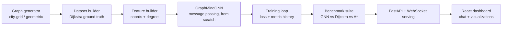

# GraphMind

**A Graph Neural Network built from scratch, trained to approximate shortest-path distance, and rigorously benchmarked against classical algorithms.**

[](https://github.com/Sriyamalhar/graphmind/actions/workflows/ci.yml)


---

## What this is

Most "GNN" or "built GPT/transformer from scratch" portfolio projects stop
at "look, it trains and generates output." GraphMind goes one step further:
it asks whether a *learned* model can approximate what a *classical,
hand-implemented algorithm* already solves exactly — and measures the honest
tradeoff, not just a demo.

Concretely: [`Meridian`](https://github.com/Sriyamalhar/meridian) (a real-time
city simulation) hand-implements Dijkstra, A*, and BFS for routing. GraphMind
takes the natural next question that raises — *could a neural network learn
to approximate shortest-path distance instead of computing it exactly?* —
and answers it with real training runs, real benchmark numbers, and an
honest writeup of where the learned model wins and where it doesn't.

## Architecture



**The model itself** (`src/graphmind/models/gnn.py`) implements message
passing, neighborhood aggregation (mean / max / attention), and node updates
directly in raw PyTorch — no `torch_geometric` or `dgl`. See
[ADR-002](docs/ADR-002-from-scratch-message-passing.md) for why.

## Why shortest-path distance regression

Rather than inventing a task and synthetic labels, GraphMind predicts
shortest-path distance between a (source, target) node pair — a task with
an unambiguous, cheaply-computed ground truth (hand-implemented Dijkstra),
and a natural classical baseline to benchmark against. See
[ADR-001](docs/ADR-001-task-framing.md) for the full reasoning and
alternatives considered.

## Benchmark results

Full methodology and results: [`docs/BENCHMARK.md`](docs/BENCHMARK.md).

Summary of the honest tradeoff being measured: the GNN answers all test
queries in a single batched forward pass (fast, approximate), while
Dijkstra/A* run exact per-pair searches (slower, exact). Both the speed gap
and the accuracy gap are reported — this is not a "GNN wins" project, it's
a "here is the real tradeoff, with numbers" project.

## Project structure

```
src/graphmind/
├── data/
│   ├── classical_algorithms.py   # Hand-implemented Dijkstra + A*
│   ├── graph_generator.py        # Synthetic city-grid / geometric graphs
│   ├── dataset.py                # Pair sampling + ground-truth labeling
│   └── features.py               # Graph -> tensor conversion
├── models/
│   └── gnn.py                    # Message passing GNN, from scratch
├── training/
│   └── train.py                  # Training loop + metric history
├── benchmark/
│   └── suite.py                  # GNN vs Dijkstra vs A* benchmark
└── serving/                      # FastAPI + WebSocket serving (in progress)

tests/                            # 23+ tests covering algorithms, model, benchmark
docs/                             # ADRs + BENCHMARK.md
scripts/run_benchmark.py          # CLI: train + benchmark end-to-end
frontend/                         # React chat + visualization dashboard (in progress)
```

## Running it yourself

```bash
git clone https://github.com/Sriyamalhar/graphmind.git
cd graphmind
pip install -e ".[dev]"

# Run the test suite
pytest tests/ -v

# Train a model and run the full benchmark
python scripts/run_benchmark.py --rows 10 --cols 10 --num-pairs 500 --epochs 60
```

## Status

This project is under active development. Current milestones:

- [x] Hand-implemented Dijkstra + A* (ground truth + speed baseline)
- [x] Synthetic city-grid graph generator
- [x] GNN implemented from scratch (message passing, 3 aggregation variants)
- [x] Training loop with metric history tracking
- [x] Benchmark suite (accuracy, speed, memory) vs. classical algorithms
- [x] CI/CD via GitHub Actions (lint + test on every push)
- [ ] Aggregation variant + depth ablation study
- [ ] Interpretability dashboard (attention maps, embedding visualization)
- [ ] FastAPI + WebSocket serving
- [ ] React frontend (chat + live visualization)
- [ ] Generalization experiment on unseen graphs (inductive setting)

## Related projects

- [`meridian`](https://github.com/Sriyamalhar/meridian) — the real-time city
  simulation whose hand-implemented Dijkstra/A*/BFS this project benchmarks
  against.
- [`graphbench`](https://github.com/Sriyamalhar/graphbench) — a benchmark
  comparing five graph databases under identical resource constraints; this
  project follows the same reproducible-benchmark methodology, applied to a
  learned model instead of a database.

## License

MIT — see [LICENSE](LICENSE).
